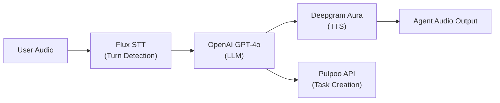

# Pulpoo Voice Agent

Voice agent that creates tasks in Pulpoo using Deepgram Flux for advanced turn detection, OpenAI for LLM processing, and Deepgram TTS for natural responses.

## Overview

- **Flux STT**: Deepgram Flux with model-integrated turn detection
- **Advanced Turn Detection**: EndOfTurn events for natural conversation flow
- **LLM Processing**: OpenAI GPT-4o for conversation understanding and function calling
- **Text-to-Speech**: Deepgram Aura-Asteria natural voice
- **Task Creation**: Creates tasks in Pulpoo through conversational interface
- **Real-time Communication**: WebSocket-based audio streaming
- **Interruption Handling**: Barge-in support when user starts speaking
- **Web Interface**: Modern UI for voice interaction

## Quick Start

```bash
# 1. Setup environment
cd agent
python3 -m venv venv
source venv/bin/activate
pip install -r requirements.txt

# 2. Configure API keys
cd agent
touch .env
# Edit .env and add your API keys:
# OPENAI_API_KEY=sk-your-openai-key
# DEEPGRAM_API_KEY=your-deepgram-key
# PULPOO_API_KEY=cwz-your-pulpoo-key

# 3. Start system
cd ..
./start.sh

# 4. Open web interface
open server/index.html
```

## Requirements

```bash
deepgram-sdk>=3.8.0
openai>=1.50.0
python-dotenv>=1.0.0
aiohttp>=3.9.0
pydantic>=2.0.0
flask>=3.0.0
flask-cors>=4.0.0
pytz>=2023.3
websockets>=12.0
requests>=2.31.0
sounddevice>=0.4.6
numpy>=1.26.0
```

## API Keys Required

- **Deepgram API Key**: Get from [Deepgram Console](https://console.deepgram.com/signup) - Used for Flux STT and Aura TTS (includes $200 free credit)
- **OpenAI API Key**: Get from [OpenAI Platform](https://platform.openai.com/api-keys) - Used for GPT-4o LLM processing
- **Pulpoo API Key**: Get from your Pulpoo account - Used for task creation

## Services

- **Flux Voice Server** (Port 8084): WebSocket server using Flux STT + OpenAI + Deepgram TTS
- **Web Interface**: Open `server/index.html` in your browser

## Usage

1. Start system: `./start.sh`
2. Open web interface in browser
3. Click "Connect" to start voice agent
4. Allow microphone access
5. Speak to create tasks

## Task Assignment

Tasks are automatically assigned to:
- `efernandez@pulpoo.com`
- `perezmd324@gmail.com`

With HIGH priority by default.

## Documentation

- **Setup Guide**: See `SETUP_INSTRUCTIONS.md` for detailed setup steps
- **Test Connection**: Run `python agent/test_deepgram_connection.py` to verify Deepgram setup

## Architecture

This system uses the **Flux Voice Agent Pattern**:



**Key Features**:
1. **Flux STT** with model-integrated EndOfTurn detection
2. **OpenAI GPT-4o** for natural language understanding and function calling
3. **Deepgram Aura TTS** for natural voice responses
4. **Pulpoo API** for task creation
5. **WebSocket** for real-time bidirectional audio streaming
6. **Interruption Handling** - User can interrupt agent at any time